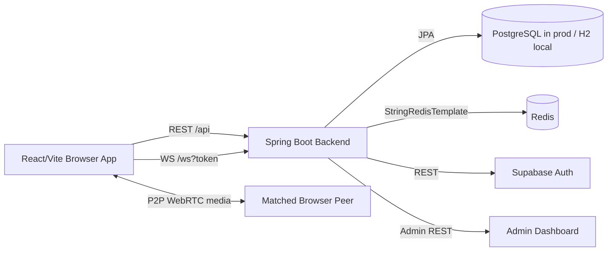
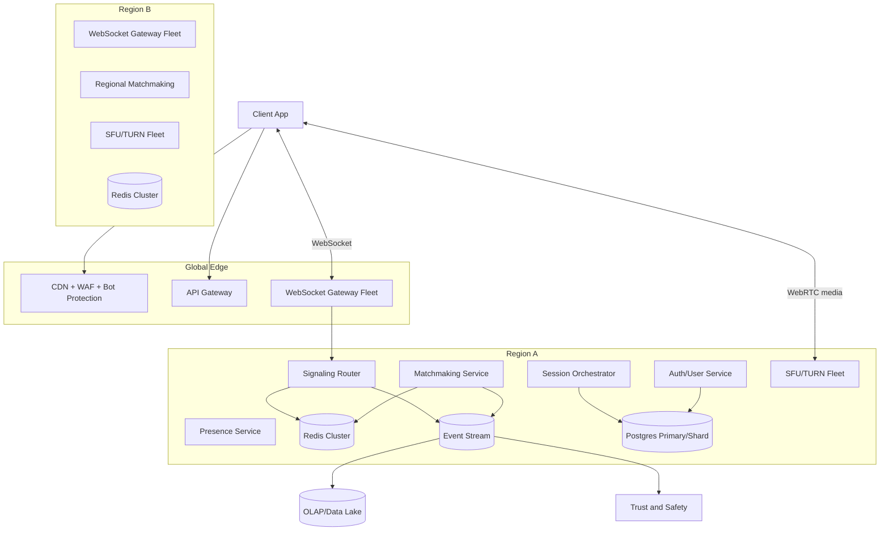
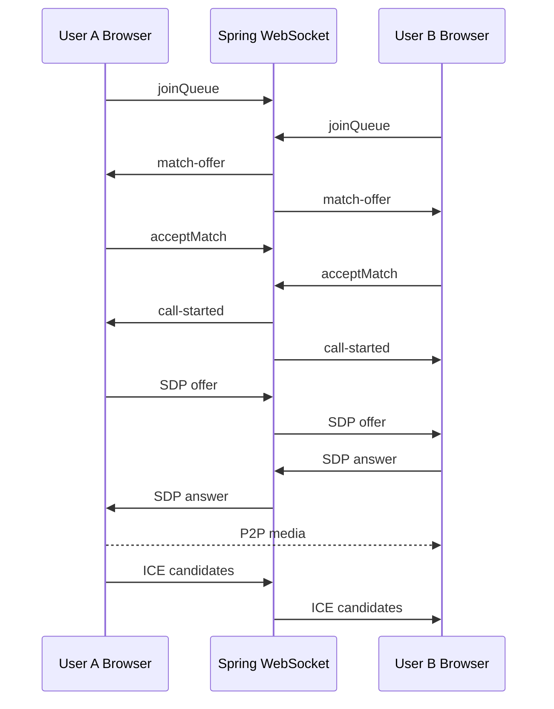
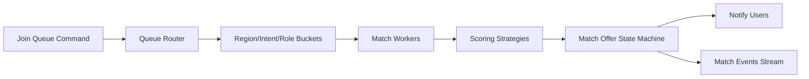

# SpeedLink Architecture and Scalability Audit

Prepared for: SpeedLink MVP  
Target platform: global real-time one-on-one video networking  
Target scale: 1M+ concurrent users  
Audit date: 2026-05-25  
Codebase reviewed: Spring Boot backend, React/Vite frontend, WebSocket signaling, WebRTC client, Redis/Postgres Docker stack

## Executive Summary

SpeedLink is currently a strong MVP architecture: a React frontend, a Spring Boot backend, authenticated WebSockets, Redis-backed queue/pending-match state, PostgreSQL persistence in production, and browser-to-browser WebRTC video. This is appropriate for proving the product loop: sign up, join a queue, match, accept, enter a video call, chat, and end the session.

It is not yet architected for 1M+ concurrent global users. The main reasons are:

| Area | Current State | 1M-User Risk |
| --- | --- | --- |
| WebSocket delivery | Local in-process session maps in one Spring service | Cross-replica signaling fails without sticky sessions or pub/sub routing |
| Matching | One large service scans Redis queue windows and keeps critical profile/session state locally | Not partitioned by region, preference bucket, or shard; fairness and race guarantees are limited |
| Video media | P2P WebRTC using only public Google STUN | TURN/SFU infrastructure is missing; connection success and bandwidth control will degrade globally |
| Persistence | JPA entities with simple repositories and `ddl-auto=update` | Needs migrations, indexes, partitioning, analytics/event separation |
| Admin dashboard | Fetches full online/queued summaries every 5 seconds | O(n) behavior and N+1 database lookups at high online counts |
| Security | JWT, Supabase verification, CORS, admin key header | No rate limiting, abuse prevention, token revocation, DDoS controls, or hardened admin auth |
| Operations | Docker Compose and basic scaling notes | Needs Kubernetes, global routing, observability, SLOs, CI/CD, load testing, and DR runbooks |

The recommended path is to evolve from a modular monolith to a distributed real-time platform:

1. Stabilize the MVP for 1k-10k users with instrumentation, rate limits, Redis pub/sub, admin pagination, indexes, and managed TURN.
2. Split realtime gateway, matchmaking, session orchestration, user/profile, and analytics boundaries for 100k users.
3. Move to regional WebSocket edge clusters, partitioned matchmaking, global presence, SFU/TURN fleets, event streaming, and multi-region data architecture for 1M+ users.

## Current System Snapshot

### Current Logical Architecture



### Current Repo Components

| Component | Files | Responsibility |
| --- | --- | --- |
| Backend app | `backend/src/main/java/com/speedlink/app` | REST APIs, WebSocket, auth, matching, persistence |
| Frontend app | `frontend/src/App.jsx` | Auth UI, profile, queue, WebSocket client, WebRTC client, admin dashboard |
| Runtime config | `application.properties`, `application-prod.properties`, `docker-compose.yml` | Tomcat, Redis, Postgres, CORS, Supabase, admin key |
| Scaling notes | `backend/SCALING.md` | Existing guidance for Redis, replicas, sticky sessions, TURN/SFU |
| Smoke test | `scripts/smoke-match.mjs` | Basic auth/matching smoke flow, currently likely stale against current Supabase signup contract |

### Important Production Defaults

| Setting | Current Value |
| --- | --- |
| `server.tomcat.max-connections` | `100000` |
| `server.tomcat.threads.max` | `800` in prod |
| `server.tomcat.accept-count` | `10000` |
| DB pool | Hikari max `20` |
| Matching scan window | `250` users |
| Match accept window | `15s` |
| Call window | `5 minutes`, extendable until disconnect |
| WebSocket send buffer | `256 KB` |
| WebSocket send time limit | `10s` |

These values raise local limits, but they do not prove capacity. Real capacity depends on instance size, OS file descriptors, load balancer limits, Redis latency, GC behavior, WebSocket churn, DB write rate, and media infrastructure.

## 1. High-Level Architecture Review

### What Works Today

- The system uses simple, understandable boundaries for an MVP.
- Redis has been introduced for queue, pending-match, rejected-pair, and profile state, which is the right direction.
- The backend keeps WebRTC media off the server; it only handles signaling, matching, chat, and call lifecycle.
- Spring Boot plus WebSocket is reasonable for initial realtime iteration.
- The code already recognizes major scaling needs in `backend/SCALING.md`: replicas, sticky sessions, Redis, managed Postgres pooling, TURN, and SFU options.

### Main Architecture Gaps

| Gap | Why It Matters | Priority |
| --- | --- | --- |
| Realtime state is local to a backend process | A user connected to replica A cannot be signaled by replica B unless delivery is routed cross-replica | P0 |
| Matching and socket delivery live in one service | Hard to scale, test, isolate failures, or evolve matching independently | P0 |
| No global/regional architecture | 1M users need locality for latency, regulation, and failure isolation | P0 |
| No event backbone | State changes are direct method calls and Redis key writes; analytics/replay/auditing are weak | P1 |
| No production media layer | P2P plus Google STUN is insufficient for reliable global calling | P0 |
| No API gateway or edge protection | DDoS, rate limits, auth enforcement, routing, and observability are incomplete | P0 |
| No observability platform | You cannot safely scale what you cannot measure | P0 |

### Recommended Target HLD



### Service Boundary Recommendations

For the next stage, do not jump immediately into many microservices. First split the backend code into internal modules. Then extract only the parts that need independent scaling.

| Boundary | Current Location | Future Responsibility | Extraction Timing |
| --- | --- | --- | --- |
| API/Auth | `AuthController`, `AuthService`, `SupabaseAuthClient` | Token exchange, profile auth, account lifecycle | 10k-100k |
| Realtime Gateway | `SpeedLinkWebSocketHandler`, parts of `MatchingService` | WebSocket auth, connection registry, message validation, rate limits | 10k |
| Matchmaking | `MatchingService` | Queue partitioning, scoring, fairness, match offers | 10k-100k |
| Session Orchestrator | `MatchingService` | Call room lifecycle, session start/end, reconnect | 100k |
| Signaling Router | `MatchingService.forwardSignal` | ICE/SDP forwarding across replicas/regions | 10k-100k |
| Chat | `MatchingService.forwardChatMessage` | Ephemeral chat, moderation, persistence if needed | 100k |
| Admin/Analytics | `adminDashboard` plus repositories | Operational summaries, dashboards, events, exports | 10k |

### Monolith vs Microservices

Recommended evolution:

| Phase | Architecture | Reason |
| --- | --- | --- |
| Now to 10k | Modular monolith plus Redis pub/sub | Faster delivery, easier consistency, lower operational burden |
| 10k to 100k | Extract realtime gateway and matchmaking workers | Different scaling profile than REST/auth |
| 100k to 1M | Regional services with event stream and media fleet | Required for latency, fault isolation, and global capacity |

Avoid premature microservices for profile CRUD, suggestions, and admin settings. Extract only high-throughput realtime boundaries first.

### API Gateway and Load Balancing

Recommended:

- Put Cloudflare/Fastly/Akamai or cloud-native WAF in front of all traffic.
- Use an API gateway for REST and WebSocket upgrade routing.
- Use L7 load balancers that support long-lived WebSocket connections.
- Use connection draining during deploys.
- Keep WebSocket gateways stateless from a product perspective, but stateful per connection. Store session routing in Redis or a presence registry.
- Use sticky sessions only as a temporary bridge. At 1M users, implement explicit connection routing/pub-sub delivery.

### WebSocket Architecture

Current:

- One `/ws` endpoint authenticates via query token.
- Connected sessions are stored in `ConcurrentHashMap<String, WebSocketSession>`.
- Message handling and delivery happen inside `MatchingService`.

Target:

- Dedicated WebSocket Gateway service.
- Validate tokens during upgrade and rotate connection tokens frequently.
- Register `userId -> gatewayId/connectionId/region` in Redis or a presence service.
- Route messages through Pub/Sub or a broker topic keyed by destination user or room.
- Apply per-connection rate limits, message size limits, schema validation, backpressure, and close codes.
- Use binary/protobuf or compact JSON only after the product semantics stabilize.

### WebRTC Signaling Architecture

Current:

- Backend forwards `offer`, `answer`, and `ice` payloads to the room peer.
- Active room participant sets are stored locally.
- Cross-replica signaling is not guaranteed.

Target:

- Move signaling to a routing layer independent of the matching engine.
- Store room membership and active endpoint routing in a distributed presence/session store.
- Use room-scoped pub/sub channels or broker partitions.
- Include message IDs, sequence numbers, and idempotency for ICE/SDP messages.
- Support reconnection, renegotiation, ICE restart, and handoff between gateway replicas.

### TURN/STUN and Media

Current:

- Browser uses only `stun:stun.l.google.com:19302`.
- No TURN credentials.
- No SFU/media server.

Target:

- Deploy managed or self-hosted TURN fleets close to users.
- Use short-lived TURN credentials issued by backend.
- Track TURN bandwidth as a top-line cost metric.
- For one-on-one calls, P2P can remain a cost optimization when connection quality is good.
- Add SFU fallback for users with poor NAT traversal, corporate networks, mobile instability, recording, moderation, or adaptive quality requirements.
- Use regional SFU vendors or open-source stacks such as LiveKit, mediasoup, Janus, or Jitsi Videobridge.

### Multi-Region Strategy

1M+ global users need regionalization.

Recommended regions:

- India/South Asia
- Southeast Asia
- Middle East
- Europe
- US East
- US West

Routing:

- Default users to nearest healthy region.
- Match users region-local by default.
- Allow cross-region matching only when preferences require it.
- Keep WebSocket, matchmaking, TURN/SFU, Redis, and ephemeral session state region-local.
- Replicate durable account/profile data asynchronously.
- Send analytics/events to a global data platform.

### Caching Layers

| Cache | Use |
| --- | --- |
| CDN edge cache | Static frontend assets, public images |
| Redis regional cluster | Presence, queue, pending matches, room routing, cooldowns, rate counters |
| Application cache | Small config values only, not critical distributed state |
| Browser cache | Static assets and profile image URLs |

Do not store base64 profile photos in user rows at scale. Use object storage plus CDN.

### Event Streaming

Introduce Kafka, Redpanda, Pulsar, or cloud-native equivalents for:

- User connected/disconnected
- Queue joined/left
- Match created/accepted/rejected/expired
- Call started/ended/continued
- Signaling quality metrics
- Abuse reports/moderation events
- Experiment exposure
- Billing/monetization events

This separates product actions from analytics, recommendations, notifications, and moderation.

### Deployment and CI/CD

Current:

- Dockerfiles exist.
- Backend image runs Maven build with `-DskipTests`.
- Frontend image uses `npm install`, not `npm ci`.
- No visible CI/CD, migrations, test gates, or deploy strategy.

Recommended:

- Use GitHub Actions/GitLab CI with build, test, static analysis, container scan, SBOM, and deploy stages.
- Use `npm ci` and Maven dependency caching.
- Stop skipping tests in production image builds once tests exist.
- Use Flyway or Liquibase migrations.
- Use blue/green or canary deployments.
- Add WebSocket connection draining.
- Use separate environments: dev, staging, load-test, prod.
- Use feature flags for matching algorithm changes.

## 2. Low-Level Design Review

### Backend Code Structure

The backend is compact, but `MatchingService` is doing too much:

- WebSocket connection registry
- Presence
- Profile cache
- Queue management
- Matching algorithm
- Pending-match lifecycle
- Call room lifecycle
- Signaling relay
- Chat relay
- Conversation persistence
- Admin dashboard aggregation
- Redis fallback logic

This violates separation of concerns and makes concurrency bugs harder to reason about.

Recommended package structure:

```text
com.speedlink.app
  auth/
  user/
  realtime/
    gateway/
    protocol/
    presence/
    signaling/
  matchmaking/
    queue/
    scoring/
    lifecycle/
  session/
  admin/
  analytics/
  infra/
    redis/
    db/
    supabase/
```

### Critical LLD Findings

| Finding | Impact | Fix | Priority | Complexity |
| --- | --- | --- | --- | --- |
| `MatchingService` is a god service | High coupling, hard testing, unsafe scaling | Split into connection, queue, scoring, session, signaling, admin services | P0 | Medium |
| Room/session state is local | Multi-replica calls/signaling break | Distributed session store plus pub/sub routing | P0 | High |
| Pending match accept is non-atomic | Race when both users accept/reject/expire across replicas | Use Redis Lua/transactions or DB state machine | P0 | Medium |
| Matching scans pairs in a 250-user window | O(k^2) per scan and limited fairness | Bucket/partition queues, candidate indexes, async workers | P1 | High |
| Admin dashboard loads full online/queued lists | O(n) and N+1 DB lookups | Pagination, cached counters, async search index | P0 | Medium |
| Redis failures silently fall back to local state | Split-brain behavior across replicas | Fail closed for distributed features or use explicit degraded mode | P0 | Medium |
| No rate limits on WebSocket messages | Abuse can exhaust CPU/Redis/socket buffers | Token bucket per user/IP/connection/message type | P0 | Medium |
| No message schema/versioning | Client/server compatibility breaks silently | Versioned protocol DTOs and validation | P1 | Medium |
| No observability around send failures | Hidden delivery failures | Structured logs, counters, close reasons, traces | P0 | Low |
| No graceful shutdown behavior | Deploys can drop calls/matches | Connection draining and session handoff/retry | P1 | Medium |

### Concurrency Risks

#### Accept/reject/expire race

`acceptMatch`, `rejectMatch`, and `expireMatch` all mutate pending match state. With multiple replicas or scheduler executions, users can see inconsistent outcomes unless state transitions are atomic.

Recommended:

- Model match as a finite-state machine: `OFFERED`, `ACCEPTED_BY_A`, `ACCEPTED_BY_B`, `MUTUALLY_ACCEPTED`, `REJECTED`, `EXPIRED`, `CANCELLED`.
- Store state in Redis using Lua scripts or in Postgres with optimistic locking/version columns.
- Make every transition idempotent and reject stale transitions.

#### Scheduled task explosion

Each pending match and call schedules a Java task. At high concurrency, scheduled task volume can become expensive and local to a replica.

Recommended:

- Use Redis sorted sets or delayed queues for expirations.
- Use workers that poll due expirations by shard.
- Use broker-delayed messages if available.

#### Local fallback split brain

Several Redis operations catch exceptions and fall back to local maps/lists. This improves local development but is dangerous in distributed production: different replicas will disagree.

Recommended:

- In production, Redis should be mandatory for queue/session features.
- Add health checks that mark the instance unready if Redis is unavailable.
- Keep local fallback only for dev profile.

### Performance Problems

| Area | Current Behavior | Scale Impact | Recommendation |
| --- | --- | --- | --- |
| Matching | Pairwise scan of first 250 queue entries | O(31k comparisons per scan; repeated scans under churn | Queue buckets by role/intent/region; precomputed candidate pools |
| Admin | Full list generation every 5s | High CPU, Redis, DB load | Counters, pagination, filters, async snapshots |
| Profile photos | Base64 stored in DB/profile payload | Large DB rows, WebSocket payloads, memory bloat | Object storage + CDN URLs |
| REST stats | Public `/api/stats` exposes live counts and may be polled | Unauthenticated polling load | Cache, rate limit, public-safe endpoint |
| Chat | In-memory client list only, no server persistence | OK for MVP; no moderation/history | Add moderation pipeline and optional persistence |
| Supabase phone lookup | Scans up to 10 pages of 1000 users | Signup latency and API pressure | Maintain local unique phone index and webhook sync |

### Connection Pooling

Current Hikari max pool is `20`. This can be fine for a realtime app if most traffic is WebSocket messages that avoid DB writes. It is not enough if every join/profile/admin action performs DB operations under high load.

Recommendations:

- Separate DB pools/read replicas for admin/reporting.
- Keep realtime hot path out of Postgres.
- Use PgBouncer or cloud connection pooling.
- Add indexes before scaling dashboard/date queries.
- Use timeouts and circuit breakers around DB/Supabase calls.

### WebSocket Optimization

Recommended additions:

- Max inbound message size.
- Message type allow-list with explicit DTO validation.
- Per-user and per-IP rate limits.
- Connection idle timeout and ping/pong tracking.
- Slow-consumer detection.
- Send queue metrics.
- Structured close codes.
- Connection draining during deploy.
- Pub/sub delivery for cross-replica sends.

### Fault Tolerance and Backpressure

Current code catches many exceptions and continues silently. That protects the user experience locally but hides production incidents.

Recommended:

- Replace swallowed exceptions with structured logs and metrics.
- Use Resilience4j for circuit breakers, retries, and timeouts around Supabase/DB/Redis where appropriate.
- Use retry with jitter for transient external calls.
- Apply backpressure: if Redis latency or send queues rise, stop accepting new queue joins temporarily and show degraded status.
- Define user-facing degraded modes: chat disabled, matching paused, admin delayed, profile save retry.

## 3. SOLID Principles and Clean Architecture

### SOLID Assessment

| Principle | Current Assessment | Notes |
| --- | --- | --- |
| Single Responsibility | Weak in `MatchingService`, moderate elsewhere | Matching, signaling, chat, admin, persistence, and session lifecycle are bundled |
| Open/Closed | Weak for matching | Adding new scoring modes requires editing core service logic |
| Liskov Substitution | Mostly not applicable | Few interfaces/abstractions exist |
| Interface Segregation | Weak | Services depend directly on concrete repositories and Redis template |
| Dependency Inversion | Partial | Spring DI exists, but domain logic depends on infrastructure APIs |

### Clean Architecture Gaps

Current design is framework-centric:

- Controllers call services.
- Services directly call repositories, Redis, Supabase clients, and WebSocket sessions.
- Domain concepts are mostly data records/entities rather than behavior-rich aggregates.

Recommended clean layering:

```text
Domain
  Match, QueueEntry, Session, Profile, MatchScore, MatchState

Application
  JoinQueueUseCase, AcceptMatchUseCase, RouteSignalUseCase, EndCallUseCase

Ports
  PresenceStore, MatchQueueStore, SessionStore, SignalPublisher, UserRepository

Adapters
  RedisPresenceStore, PostgresUserRepository, WebSocketSignalPublisher, SupabaseAuthAdapter
```

### DDD Recommendations

Bounded contexts:

- Identity and Profile
- Presence
- Matchmaking
- Conversation Session
- Signaling
- Trust and Safety
- Analytics
- Admin Operations

Key aggregates:

- `UserProfile`
- `QueueEntry`
- `MatchOffer`
- `ConversationSession`
- `RealtimeConnection`

### CQRS and Event Sourcing

Do not use full event sourcing immediately. It adds complexity. Use event-driven CQRS where useful:

- Command path: join queue, accept match, reject match, start call.
- Query path: admin dashboard, analytics, user history.
- Event stream: append immutable operational events for analytics and audits.

For 1M users, this separation becomes important because admin/reporting queries must never run on the realtime hot path.

## 4. Design Patterns

| Pattern | Where It Fits | Why It Matters |
| --- | --- | --- |
| Strategy | Match scoring modes: basic, preference, geo, AI-assisted | Add algorithms without editing central matching flow |
| Factory | WebSocket message handlers, DTO creation, TURN credential issuance | Centralizes construction and validation |
| Observer/PubSub | Queue updates, session events, signaling delivery | Decouples services and supports horizontal scale |
| Adapter | Supabase, Redis, Postgres, TURN/SFU provider | Makes providers replaceable and testable |
| Repository | Already used for JPA; add domain repositories/ports | Keeps domain away from persistence details |
| Builder | Complex payloads like call/session responses | Reduces constructor noise as payloads grow |
| Mediator | WebSocket message dispatcher | Avoids a giant switch in the service layer |
| State | Match and call lifecycle | Prevents invalid transitions under race conditions |
| Circuit Breaker | Supabase, Redis, DB, TURN credential provider | Prevents cascading failures |
| Retry | External calls with transient failures | Improves resilience with jitter and limits |
| Saga | Signup/profile creation, billing, moderation workflows | Coordinates multi-service operations |

### Immediate Pattern Refactor

Replace:

```text
MatchingService.handle() switch(type)
```

With:

```text
ClientMessageDispatcher
  Map<MessageType, ClientMessageHandler>

JoinQueueHandler
AcceptMatchHandler
RejectMatchHandler
SignalHandler
ChatMessageHandler
EndCallHandler
```

This makes rate limiting, validation, metrics, and permissions easier to apply per message type.

## 5. Real-Time Video Calling Architecture

### Current WebRTC Flow



### Current Issues

- Only STUN is configured; no TURN fallback.
- Signaling has no sequence IDs or idempotency.
- No ICE restart handling.
- No reconnect-to-existing-call path if WebSocket drops.
- No quality metrics from `RTCPeerConnection.getStats()`.
- No adaptive bitrate policy exposed in the UI/client.
- No SFU fallback for restrictive NATs, mobile networks, or moderation.
- No media device preflight before match acceptance.

### Production Video Architecture

For 1M concurrent users, distinguish:

- 1M online users
- 1M users in queue
- 1M users in active calls
- 500k one-on-one calls

The last case is the hardest and most expensive.

Recommended model:

| Scenario | Media Path | Rationale |
| --- | --- | --- |
| Good networks, same/near region | P2P WebRTC | Lowest server cost |
| Strict NAT/corporate/mobile failures | P2P via TURN relay | Improves connection success |
| Poor quality or compliance features | SFU | Better control, diagnostics, moderation, recording |
| Future group/networking rooms | SFU required | P2P mesh does not scale |

### TURN Scaling

TURN relays media. Bandwidth costs can dominate infrastructure spend.

Recommendations:

- Deploy regional TURN fleets.
- Use autoscaling based on network egress, allocations, and CPU.
- Issue ephemeral credentials via REST.
- Enforce per-session TTL and bandwidth quotas.
- Track relay ratio: percentage of calls using TURN.
- Prefer P2P when direct connection quality is good.

### SFU Scaling

For one-on-one calls, an SFU is optional but valuable for reliability. At massive scale, use it selectively:

- Start P2P with TURN fallback.
- Promote to SFU when direct connection fails or quality drops.
- Use SFU for paid/pro/moderated/recorded sessions.
- Region-pin SFU selection.

Metrics to collect:

- Call setup success rate
- Time to first media
- ICE failure rate
- TURN relay rate
- Packet loss, jitter, RTT
- Reconnect count
- Average bitrate
- Browser/device/network type

## 6. Matchmaking System Review

### Current Algorithm

Current matching:

- Queue stored in Redis list, with local fallback.
- `MATCH_SCAN_LIMIT = 250`.
- Scans pairs in the queue window.
- Scores role/looking-for compatibility, interests, intent, and company type.
- Supports basic/random mode.
- Uses rejected-pair cooldown.
- Creates pending match with 15-second accept window.

### Strengths

- Simple and explainable.
- Bounded scan avoids full-queue O(n) or O(n^2) behavior.
- Compatibility scoring is deterministic.
- Reject cooldown avoids immediate repeat matches.

### Weaknesses

| Weakness | Impact |
| --- | --- |
| Pairwise scan is still O(k^2) for k=250 | CPU spikes under frequent joins/leaves |
| First-window scanning can starve users beyond the first 250 | Fairness risk |
| Profile data is local/in Redis, not normalized into searchable candidate indexes | Poor fit for advanced recommendations |
| No geographic, language, latency, or availability partitioning | Bad global match quality |
| No anti-abuse/bot scoring | Queue can be polluted |
| No experiment framework | Hard to safely test new algorithms |
| Accept/reject state is not atomically transitioned | Race risk |

### Recommended Matchmaking Architecture



### Queue Partitioning

Partition by:

- Region
- Language
- User intent
- Role/looking-for
- Age range or compliance constraints if applicable
- Trust score
- Subscription tier if monetized

Use Redis sorted sets or streams per bucket:

- Score can represent enqueue time or priority.
- Workers consume from compatible buckets.
- Starvation prevention can increase priority over time.

### Ranking and Recommendation

At later stages:

- Use candidate generation first, ranking second.
- Candidate generation: filters/buckets/geo/availability.
- Ranking: compatibility, mutual intent, historical acceptance rate, quality score, user feedback.
- ML can rank candidates, but should not be introduced before event instrumentation is reliable.

### Fairness

Add:

- Max wait-time boost.
- Rejection cooldown.
- Repeat-match suppression.
- Diversity constraints.
- New-user warm start.
- Region fallback after timeout.

### Anti-Spam and Abuse

Add:

- Queue join rate limits.
- Device/session fingerprinting with privacy controls.
- CAPTCHA or proof-of-work on suspicious signup/join behavior.
- Trust score based on reports, disconnects, no-shows, spam messages.
- Moderation and reporting pipeline.
- Ban/suspend enforcement in WebSocket gateway.

## 7. Database and Storage Review

### Current Schema

Entities:

- `UserAccount`
- `ConversationSession`
- `UserSuggestion`
- `AppSetting`

The schema is enough for MVP. It is not enough for analytics, recommendations, moderation, or global operations.

### Indexing Recommendations

Add explicit indexes:

| Table | Index |
| --- | --- |
| `user_accounts` | `email`, `phone`, `supabase_user_id`, `created_at` |
| `conversation_sessions` | `started_at`, `status`, `user_a_id`, `user_b_id`, `(user_a_id, started_at)`, `(user_b_id, started_at)` |
| `user_suggestions` | `created_at`, `user_id`, `category` |
| `app_settings` | primary key only is fine |

Do not rely only on JPA `@Column(unique=true)` for production schema management. Use migrations.

### Storage Concerns

Profile photos are stored as up to 4000-character strings, and the frontend reads files as Data URLs. This will not scale.

Recommended:

- Upload images to object storage.
- Store URL plus metadata in DB.
- Serve through CDN.
- Generate thumbnails.
- Validate size/type and scan uploads.

### Database Choices by Workload

| Workload | Recommended Store |
| --- | --- |
| User/account/profile transactional data | PostgreSQL, possibly sharded later |
| Presence and queue state | Redis Cluster / KeyDB / Dragonfly, region-local |
| Event streams | Kafka, Redpanda, Pulsar, Kinesis, Pub/Sub |
| Analytics | ClickHouse, BigQuery, Snowflake, Databricks |
| Search/recommendation candidate lookup | OpenSearch/Elasticsearch plus feature store, or vector DB where needed |
| Media metadata | PostgreSQL plus object storage |
| Session logs | Event stream to OLAP, not primary DB hot path |

### Sharding and Partitioning

At 1M+:

- Partition conversation/session history by month and region.
- Shard users by user ID hash or home region.
- Keep presence strictly regional and ephemeral.
- Use async replication for global profile reads.
- Avoid distributed transactions in the realtime path.

## 8. Security and Reliability Review

### Current Security Strengths

- Supabase session verification is used.
- SpeedLink issues its own app JWT.
- WebSocket authenticates the token on connection.
- CORS origins/patterns are configurable.
- Admin endpoints require `X-SpeedLink-Admin-Key`.

### Security Gaps

| Gap | Risk | Recommendation |
| --- | --- | --- |
| Admin auth is a static shared key | Leakage gives full admin access | Use real admin accounts, RBAC, MFA, audit logs |
| WebSocket token in query string | Tokens may appear in logs | Prefer short-lived connection ticket or `Sec-WebSocket-Protocol` token |
| No rate limiting | Brute force, spam, message flood | Gateway-level and app-level rate limits |
| No abuse pipeline | Unsafe video platform risk | Reporting, blocking, moderation, trust scoring |
| No token revocation | Compromised token valid until expiry | Token version/session table or short TTL/refresh |
| No DDoS protection in repo infra | Public endpoints vulnerable | WAF, bot protection, autoscaling, provider DDoS |
| Public `/api/stats` | Can expose platform activity | Cache, aggregate, hide sensitive counters |
| No CSP/security headers visible in frontend Nginx | Browser hardening gap | Add CSP, HSTS, X-Content-Type-Options |
| No secrets management | Compose includes placeholder secrets | Cloud secret manager, rotation, no defaults in prod |

### WebRTC Security

Add:

- Short-lived TURN credentials.
- DTLS-SRTP is built into WebRTC, but still validate signaling authorization.
- Room membership checks in distributed session store.
- Per-room message sequence and replay protections.
- Optional call reporting and block user flow.
- No recording without explicit consent.

### Reliability

Add:

- Health/readiness checks for Redis, DB, Supabase dependency mode.
- Graceful shutdown: stop accepting new WebSocket connections, drain existing sockets, notify clients.
- Runbooks for Redis outage, DB outage, deploy rollback, TURN saturation, regional failover.
- Circuit breakers around external dependencies.

## 9. Scalability Bottlenecks by Stage

### Bottleneck Matrix

| Bottleneck | Why It Occurs | Impact at Scale | Fix | Priority | Complexity |
| --- | --- | --- | --- | --- | --- |
| Local WebSocket sessions | `sessions` map exists per JVM | Cross-replica delivery failure | Gateway registry + pub/sub | P0 | High |
| Local active rooms | `activeRooms`, `userToRoom`, `callSessions` are local | Calls cannot survive replica mismatch/restart | Distributed session store | P0 | High |
| Redis fallback to local state | Production split brain | Inconsistent queue/match state | Mandatory Redis in prod | P0 | Medium |
| Matching O(k^2) scan | Pairwise scoring in queue window | CPU spikes and fairness issues | Bucketed matching workers | P1 | High |
| Admin dashboard O(n) | Full online/queued list and DB lookups | Admin page can hurt prod | Pagination/cached snapshots | P0 | Medium |
| No TURN/SFU | P2P fails for many networks | Low call success, poor global UX | Managed TURN and SFU fallback | P0 | High |
| No rate limits | Unlimited messages/joins | Abuse and resource exhaustion | Gateway token buckets | P0 | Medium |
| No observability | Failures hidden | Slow incident response | Metrics/logs/tracing | P0 | Medium |
| JPA auto schema | `ddl-auto=update` | Unsafe migrations | Flyway/Liquibase | P1 | Low |
| DB pool constraints | Pool 20 per replica | REST/admin/profile bottlenecks | PgBouncer/read replicas | P1 | Medium |
| WebSocket reconnect storm | Clients retry up to 5s | Thundering herd after outage | Jitter/backoff/server hints | P1 | Low |
| Supabase admin scans | Phone lookup pages users | Signup latency/API load | Local indexed uniqueness | P1 | Medium |

### 10k Concurrent Users

Likely issues:

- Single backend may work only with careful instance sizing and light traffic.
- Admin dashboard full summaries become expensive.
- No rate limiting becomes a practical abuse risk.
- TURN absence creates support issues.
- Redis failure fallback becomes dangerous if multiple replicas are added.

Required fixes:

- Add metrics, logs, dashboards.
- Add rate limiting.
- Add Redis pub/sub or sticky sessions.
- Add admin pagination.
- Add managed TURN.
- Add load tests.

### 100k Concurrent Users

Likely issues:

- Single region and single backend fleet become insufficient.
- Matching worker CPU and Redis latency become major constraints.
- WebSocket gateway needs independent scaling.
- Cross-replica signaling must be solved.
- Postgres write/read contention appears for auth/profile/admin/history.

Required fixes:

- Dedicated realtime gateway.
- Distributed presence/session store.
- Bucketed matchmaking workers.
- Regional Redis cluster.
- Event stream.
- DB migrations, indexes, read replicas, connection pooler.
- SFU/TURN operational plan.

### 1M+ Concurrent Users

Likely issues:

- Global latency and regional outages dominate architecture.
- WebSocket fan-in and connection churn require edge/regional gateway fleets.
- Matchmaking must be partitioned and eventually consistent.
- Media relay/SFU cost and autoscaling dominate spend.
- Analytics, moderation, abuse detection, and reliability become first-class systems.

Required fixes:

- Multi-region active-active architecture.
- Regional WebSocket gateways and matchmaking.
- Global control plane, regional data plane.
- Event streaming and OLAP platform.
- Trust and safety platform.
- Autoscaled TURN/SFU fleets.
- SLO-based operations and chaos testing.

## 10. Production Readiness Checklist

### Application

- [ ] Split `MatchingService` responsibilities.
- [ ] Add WebSocket message validation and versioning.
- [ ] Add per-message rate limits.
- [ ] Add idempotent match/call state machines.
- [ ] Add Redis pub/sub routing for cross-replica signaling.
- [ ] Remove production local fallback for distributed state.
- [ ] Add admin pagination and cached counters.
- [ ] Move profile images to object storage.
- [ ] Add tests for matching, accept/reject races, reconnects, and call lifecycle.

### Infrastructure

- [ ] Managed PostgreSQL with backups, PITR, monitoring, and pooler.
- [ ] Managed Redis or Redis Cluster with persistence/replication as needed.
- [ ] WAF/CDN/API gateway.
- [ ] Kubernetes or equivalent orchestration.
- [ ] Horizontal pod autoscaling.
- [ ] WebSocket-aware load balancer.
- [ ] Graceful deploys with connection draining.
- [ ] Managed TURN service.
- [ ] SFU proof of concept.

### Security

- [ ] Replace admin key with RBAC admin auth.
- [ ] Add rate limiting and abuse detection.
- [ ] Add secrets manager.
- [ ] Add CSP/HSTS/security headers.
- [ ] Add audit logs for admin actions.
- [ ] Add token revocation or short-lived connection tickets.
- [ ] Add report/block flows.

### Observability

- [ ] Metrics: connections, queue size, match rate, accept rate, call success, Redis latency, DB latency.
- [ ] Logs: structured JSON with request/user/session/room correlation IDs.
- [ ] Tracing: REST, WebSocket command handling, Redis, DB, Supabase.
- [ ] Alerts: SLO burn, error rate, reconnect storms, media failure, Redis p99, DB pool exhaustion.
- [ ] Dashboards: realtime health, matchmaking funnel, media quality, region status.

### Load Testing

- [ ] WebSocket connect/heartbeat test.
- [ ] Queue join/leave churn test.
- [ ] Match accept/reject/expire race test.
- [ ] Signaling message burst test.
- [ ] Admin dashboard load test.
- [ ] Soak test for memory/GC leaks.
- [ ] Regional failover drill.
- [ ] TURN/SFU bandwidth test.

## 11. Scalability Roadmap

### Phase 0: MVP Hardening, 1k-5k Users

Goals:

- Make current system measurable and safe.
- Avoid avoidable production incidents.

Actions:

- Add Micrometer/Prometheus metrics and structured logs.
- Add rate limiting for REST and WebSocket.
- Add admin dashboard pagination.
- Add DB indexes and Flyway migrations.
- Add managed TURN credentials.
- Add test coverage around matching and call lifecycle.
- Fix `scripts/smoke-match.mjs` to match current Supabase auth flow or create a backend test fixture mode.

### Phase 1: Scale to 10k Users

Actions:

- Run multiple backend replicas behind a WebSocket-aware load balancer.
- Add Redis pub/sub signaling or strict sticky sessions.
- Make Redis mandatory in production.
- Split realtime gateway and matching logic internally.
- Add graceful shutdown.
- Add load test environment.
- Store profile photos in object storage.

### Phase 2: Scale to 100k Users

Actions:

- Extract WebSocket Gateway service.
- Extract Matchmaking worker service.
- Use Redis Cluster or equivalent.
- Introduce Kafka/Redpanda event stream.
- Add distributed session store.
- Add bucketed matching by region/preferences.
- Add read replicas and PgBouncer.
- Add SFU fallback.
- Add trust/safety event pipeline.

### Phase 3: Scale to 1M+ Users

Actions:

- Multi-region active-active realtime data plane.
- Regional WebSocket gateways, matching, Redis, TURN/SFU.
- Global account/profile control plane.
- Eventual consistency across regions.
- Regional failover and traffic evacuation.
- ML ranking/recommendation platform.
- Real-time analytics and experimentation.
- Dedicated SRE/on-call program.

## 12. Future-Scale Recommendations

### Ideal Cloud Architecture

Cloud-neutral reference:

- CDN/WAF: Cloudflare, Fastly, Akamai, or cloud-native equivalent.
- API gateway: Kong, Envoy Gateway, AWS API Gateway/ALB, GCP Load Balancing, Azure Front Door.
- Compute: Kubernetes with separate node pools for REST, WebSocket, matchmaking, media.
- Database: Managed Postgres with read replicas and PgBouncer.
- Redis: Managed Redis Cluster per region.
- Event stream: Kafka/Redpanda/Pulsar or managed equivalent.
- Media: LiveKit Cloud/self-hosted, mediasoup, Janus, Jitsi, or vendor SFU.
- TURN: coturn fleets or managed TURN.
- Object storage: S3/GCS/Azure Blob plus CDN.
- Observability: Prometheus/Grafana, OpenTelemetry, Loki/ELK, Tempo/Jaeger, Sentry.
- Secrets: AWS Secrets Manager/GCP Secret Manager/Vault.

### Infrastructure Separation

Use separate accounts/projects/namespaces for:

- Production
- Staging
- Load testing
- Development
- Data/analytics
- Security tooling

Separate workloads:

- REST API pods
- WebSocket gateway pods
- Matchmaking workers
- Session/signaling routers
- Admin/reporting APIs
- Media servers

### Autoscaling Strategy

| Workload | Scale Metric |
| --- | --- |
| WebSocket Gateway | Active connections, CPU, send queue depth, reconnect rate |
| Matchmaking Workers | Queue depth, match latency, Redis p99 |
| REST API | RPS, CPU, DB latency |
| TURN | Network egress, allocation count, packet rate |
| SFU | CPU, bandwidth, rooms, packet loss |
| Event Consumers | Consumer lag |

### Observability Metrics to Add

Product funnel:

- Signup success/failure
- WebSocket connect success
- Join queue count
- Match offer count
- Accept rate
- Reject/expire rate
- Call started count
- Call setup success
- Average call duration

Technical:

- Active WebSocket connections
- WebSocket messages by type
- Send failures by close reason
- Redis operation latency
- DB query latency and pool usage
- JVM heap/GC/thread counts
- Matchmaking loop duration
- Queue wait time p50/p95/p99
- ICE failure rate
- TURN relay ratio

### SRE Recommendations

- Define SLOs:
  - WebSocket connect success > 99.9%
  - Match offer latency p95 < 2s after compatible users available
  - Call setup success > 97% in supported regions
  - REST auth p95 < 500ms
- Add error budgets.
- Run game days:
  - Redis outage
  - DB pool exhaustion
  - WebSocket gateway restart
  - TURN region saturation
  - Supabase latency spike
  - Partial regional outage

## Priority Matrix

| Priority | Work Item | Business Impact | Engineering Complexity |
| --- | --- | --- | --- |
| P0 | Add observability and load testing | Prevents blind scaling | Medium |
| P0 | Add rate limiting and abuse prevention | Protects platform and users | Medium |
| P0 | Redis pub/sub or distributed signaling | Enables multi-replica realtime | High |
| P0 | Managed TURN | Improves call success | Medium |
| P0 | Admin pagination/counters | Prevents admin from harming prod | Medium |
| P0 | Atomic match state machine | Prevents race bugs | Medium |
| P1 | Split `MatchingService` | Improves maintainability and scale | Medium |
| P1 | Flyway/Liquibase migrations and indexes | Production DB safety | Low |
| P1 | Object storage for profile photos | Reduces DB/payload bloat | Medium |
| P1 | Graceful shutdown | Safer deployments | Medium |
| P2 | SFU fallback | Higher reliability and future features | High |
| P2 | Event streaming | Analytics/recommendations foundation | High |
| P2 | Multi-region active-active | Required for 1M global | Very High |

## Code Quality Feedback

### Positive

- The code is readable and compact.
- DTOs and records are used where appropriate.
- Redis has already been introduced for core queue state.
- WebSocket send is wrapped with `ConcurrentWebSocketSessionDecorator`.
- The matching algorithm is simple enough to reason about.
- The frontend handles reconnects and keeps UI state responsive.

### Needs Improvement

- `MatchingService` is too broad and should be decomposed.
- Test coverage is very limited; no backend tests were found in the repository.
- The smoke script appears stale compared with the current Supabase-backed signup request.
- Many exceptions are swallowed, hiding production failure modes.
- Security relies too much on shared keys and client-side discipline.
- Frontend stores app tokens in local/session storage; this is common for SPAs but increases XSS blast radius.
- WebRTC only uses public STUN; no production ICE server strategy exists.
- Docker builds skip backend tests and use `npm install` rather than deterministic `npm ci`.

## Recommended Immediate Engineering Plan

### Week 1-2

- Add metrics/logging/tracing basics.
- Add backend tests for matching lifecycle.
- Add admin dashboard pagination.
- Add DB migrations and indexes.
- Add REST/WebSocket rate limiting.
- Add production Redis mandatory mode.

### Week 3-4

- Split `MatchingService` into internal services.
- Implement match state machine with atomic Redis transitions.
- Add Redis pub/sub signaling.
- Add graceful shutdown and WebSocket draining.
- Add TURN credential endpoint and configure frontend ICE servers.

### Month 2

- Introduce load test suite for 1k, 5k, 10k WebSocket users.
- Add bucketed matchmaking.
- Add object storage for profile images.
- Add admin RBAC and audit logs.
- Add event stream for lifecycle events.

### Month 3+

- Extract realtime gateway and matchmaking workers.
- Add SFU fallback proof of concept.
- Build regional deployment model.
- Add analytics warehouse and recommendation event pipeline.
- Start multi-region architecture design.

## Final Verdict

SpeedLink is a good MVP foundation, but it should be treated as a single-region, early-stage realtime application. With careful hardening, it can likely support a meaningful pilot and low-thousands of concurrent users. For 10k users, it needs observability, rate limits, TURN, Redis-backed cross-replica signaling, admin pagination, and concurrency-safe match state. For 100k users, it needs extracted realtime/matchmaking services, event streaming, distributed session routing, and media infrastructure. For 1M+ global users, it needs a regional realtime data plane, global control plane, partitioned matchmaking, autoscaled TURN/SFU fleets, strong abuse prevention, and mature SRE operations.

The most important next move is not to rewrite everything. The best path is to modularize the current monolith around the actual domain boundaries, add instrumentation and safety controls, then extract the high-throughput realtime pieces only when load testing proves the need.
